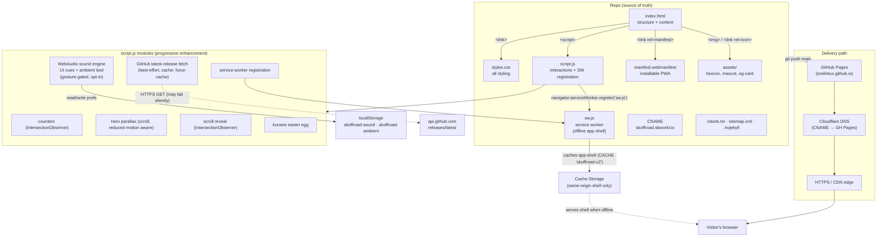

# SOP — skoffroad-skworld-io

Standard Operating Procedure for the S&K OFFROAD marketing site, scaled to a
static, single-page website. Aligned to the [sk-standards](https://github.com/smilinTux/sk-standards)
9-section doc bar.

---

## 1. Overview

`skoffroad-skworld-io` is the public marketing / landing site for **S&K OFFROAD**,
a browser-playable multiplayer offroad game. It is a **static single-page site**
(hand-written HTML/CSS/JS, no build step, no framework) served over HTTPS at
[skoffroad.skworld.io](https://skoffroad.skworld.io).

There is no backend, no database, and no secret material. All content is public
by design — it is a brochure/landing page. The client-side behaviour is
progressive-enhancement JavaScript: counters, hero parallax, scroll reveal, an
opt-in synthesized **sound engine** (UI cues + an ambient bed), a **service
worker** that caches the app-shell for offline use (the site is an installable
**PWA** via `manifest.webmanifest`), and a best-effort fetch of the latest GitHub
release tag.

---

## 2. Architecture

**Start here (in order):**
1. `index.html` — page structure, content, and all section markup. Read this first.
2. `styles.css` — every visual rule (no preprocessor, no CSS build).
3. `script.js` — all interactive behaviour (see module list below); also registers the service worker.
4. `sw.js` — the service worker (offline app-shell cache).
5. `manifest.webmanifest` — the web app manifest (installable PWA).
6. `CNAME` — the custom-domain binding for GitHub Pages.



**Service worker (`sw.js`) — offline app-shell / PWA.** The site registers a
same-origin service worker (from `script.js`, guarded by `'serviceWorker' in
navigator`). It maintains one cache, `CACHE = 'skoffroad-v2'`, seeded on install
with the app-shell (`./`, `index.html`, `styles.css`, `script.js`, the mascot and
favicon SVGs). Fetch strategy:

- **HTML / navigations → network-first.** Fetch the network copy (and refresh the
  cache); if the network fails, fall back to the cached page, then to the cached
  `index.html` shell. Content stays fresh online and the shell still loads offline.
- **Static assets → cache-first**, with a quiet background revalidate (stale-
  while-revalidate).
- **Cross-origin requests are never cached.** Google Fonts, the GitHub releases
  API, and the `play.` subdomain always go straight to the network. Only
  same-origin GETs are handled.
- **Cache versioning.** Bumping `CACHE` (e.g. `skoffroad-v2` → `-v3`) invalidates
  the old shell on the next visit; the `activate` handler deletes stale caches.

**Web manifest (`manifest.webmanifest`).** Makes the site an installable PWA:
`display: standalone`, `start_url`/`scope` `./`, theme/background `#0c0a09`, and a
scalable `favicon.svg` icon. Linked from `index.html` via `<link rel="manifest">`.

**WebAudio sound engine (`script.js`).** Fully synthesized (no external audio
assets), two independent opt-in channels:

- **UI cues** — short synthesized blips, toggled by `#sound-toggle`, pref
  `localStorage['skoffroad-sound']`.
- **Ambient bed** — a low-volume wind + engine-idle soundscape, toggled by
  `#ambient-toggle`, pref `localStorage['skoffroad-ambient']`.

Rules honored: **no autoplay** (an `AudioContext` is only created and resumed
inside a real user gesture), both channels **default off**, `prefers-reduced-
motion` keeps them off by default, and each choice is persisted independently in
`localStorage`. Each toggle button hides itself if the browser has no WebAudio
support.

---

## 3. Build

**None.** There is no build step, bundler, transpiler, or CSS preprocessor. The
files in the repo are the files that ship — including `sw.js` and
`manifest.webmanifest`, which are served verbatim. `.nojekyll` disables Jekyll
processing on GitHub Pages so files are served as-is.

Local preview (optional):

```sh
python3 -m http.server 8080
# open http://localhost:8080
# note: the service worker only registers on a secure origin
# (https:// or http://localhost), so localhost is fine for testing the PWA.
```

---

## 4. Test (the green gate)

Because there is no build, the gate is lightweight static validation. It must be
green before merge to `main`:

```sh
# 1. JavaScript syntax check — EVERY .js file in the repo root, including the SW
node --check script.js
node --check sw.js

# 2. HTML well-formedness — either of:
npx --yes html-validate index.html     # if network/npx available
#   or an offline sanity check that tags balance / parse without errors
python3 -c "import html.parser,sys; \
  class P(html.parser.HTMLParser): pass; \
  P().feed(open('index.html',encoding='utf-8').read()); print('index.html parsed OK')"
```

Green = `node --check` exits 0 for **both** `script.js` and `sw.js`, and
`index.html` parses without errors. There are currently no unit tests (there is
no application logic to unit-test).

---

## 5. Release / Deploy

**Delivery path:** `main` branch → **GitHub Pages** (org site
`smilintux.github.io`) → **Cloudflare DNS** (`skoffroad` CNAME, DNS-only / gray
cloud) → HTTPS/CDN edge → visitor's browser.

Publishing is automatic: pushing to `main` triggers GitHub Pages to rebuild and
serve the site. The custom domain is bound by the `CNAME` file
(`skoffroad.skworld.io`); GitHub Pages provisions the TLS certificate once DNS
resolves. Because the service worker caches the app-shell, bump `CACHE` in
`sw.js` when you ship a shell change you need clients to pick up immediately.

**Front-end / exposure note:** this is a **public static site** — that is fine
and intended. It carries no secrets, no credentials, no server-side code, and no
user data. There is nothing to exfiltrate. Exposure of the source (it is
GPL-3.0) and of the served HTML/CSS/JS is expected and acceptable.

Deploys from this SOP work are **not** performed here — no push, no force, no
deploy. Publishing is a separate, deliberate `git push` of `main`.

---

## 6. Config / Usage

**Minimal.** There is no server config and no environment. Runtime state is
client-side only:

| Key | Store | Values | Default | Purpose |
|-----|-------|--------|---------|---------|
| `skoffroad-sound` | `localStorage` | `on` / `off` | `off` | Remembers the visitor's UI-sound choice |
| `skoffroad-ambient` | `localStorage` | `on` / `off` | `off` | Remembers the ambient-soundscape choice |
| `skoffroad-v2` | Cache Storage (service worker) | app-shell files | — | Offline app-shell cache (same-origin, public assets only) |

`CNAME` (repo file) is the only "config" that affects deployment — it names the
custom domain for GitHub Pages. `manifest.webmanifest` controls PWA install
metadata (name, icons, theme colour, standalone display).

---

## 7. API / Reference

**N/A — the site exposes no API and calls no first-party backend.**

Notable client behaviours worth referencing:

- **Sound (`#sound-toggle` / `#ambient-toggle`).** Opt-in only, two independent
  channels (UI cues + ambient bed). Nothing plays until the user clicks/keys a
  gesture (WebAudio autoplay policy). Each choice persists in `localStorage`
  (`skoffroad-sound` / `skoffroad-ambient`). Under `prefers-reduced-motion:
  reduce`, both default off.
- **Latest-release fetch.** `script.js` does a best-effort
  `GET https://api.github.com/repos/smilinTux/skoffroad/releases/latest`
  (`cache: force-cache`) purely to stamp the newest tag into the hero eyebrow. If
  rate-limited or offline it fails silently and the static copy is kept. The
  service worker never caches this cross-origin call.
- **Offline / PWA.** `sw.js` is a same-origin service worker caching the app-shell
  under `CACHE = 'skoffroad-v2'`: **network-first** for HTML/navigations (fresh
  online, cached shell + `index.html` fallback offline), **cache-first** for
  static assets (background revalidate). Cross-origin requests are never cached.
  `manifest.webmanifest` makes the site installable (standalone display, `./`
  scope). Bump `CACHE` to force clients onto a new shell.

---

## 8. Troubleshooting

| Symptom | Check |
|---------|-------|
| Sound doesn't play (UI or ambient) | Sound is **opt-in and gesture-gated**. Confirm the relevant toggle (`#sound-toggle` / `#ambient-toggle`) shows "on" (`aria-pressed="true"`); a real click/keypress is required to unlock `AudioContext`; both channels **default off**; browser/tab may be muted; `prefers-reduced-motion: reduce` keeps sound off by default; some browsers gate WebAudio until interaction. |
| A sound button is missing | The toggle hides itself (`hidden`) when the browser has no `AudioContext` / `webkitAudioContext`. |
| Sound choice not remembered | `localStorage` blocked (private mode / storage disabled) — code degrades gracefully to default-off. |
| Page blank / stale after deploy | GitHub Pages build lag, CDN cache, **or a stale service-worker shell**. `sw.js` caches the app-shell (`skoffroad-v2`) and is network-first for HTML, so a fresh online load should update — but a wedged SW can serve an old shell. Fix: hard-refresh; bump `CACHE` in `sw.js` (invalidates the old shell on next visit); or in DevTools → Application → Service Workers, Unregister and reload. Confirm the Pages build succeeded and `CNAME` resolves via Cloudflare. |
| Offline load fails / no install prompt | The service worker only registers on a **secure origin** (`https://` or `http://localhost`). Confirm the site is served over HTTPS, that `sw.js` registered (DevTools → Application → Service Workers), and that `manifest.webmanifest` loads (Application → Manifest). A first (online) visit is required to populate the cache before offline works. |
| Custom domain shows cert/404 | DNS: `skoffroad` CNAME → `smilintux.github.io` must be DNS-only (gray cloud) for GH Pages to issue TLS; `CNAME` file must match. |
| Latest-release tag not updating | `api.github.com` rate-limited or unreachable; `cache: force-cache` may serve an older response — expected best-effort degradation (never cached by the SW). |
| Counters / reveal not animating | `prefers-reduced-motion: reduce` disables parallax and reveal by design; content stays fully visible (progressive enhancement). |

---

## 9. Maturity tier + Version

- **Maturity tier: `T0 — N/A (static site, no key material)`.** This repo holds
  no keys, no secrets, no crypto, and no server-side identity. The sk-standards
  crypto/maturity ladder does not apply; T0 records that it was assessed and is
  out of scope.
- **Versioning:** the site itself is effectively **unversioned / continuously
  deployed** — `main` is the live site. The service-worker cache carries its own
  independent version tag (`CACHE = 'skoffroad-v2'`), bumped when the app-shell
  changes. Where a release tag is referenced (the hero eyebrow pulls the latest
  **game** release from `smilinTux/skoffroad`), that game follows SemVer
  independently of this marketing repo.

---

*Doc bar reference: [smilinTux/sk-standards](https://github.com/smilinTux/sk-standards).*
